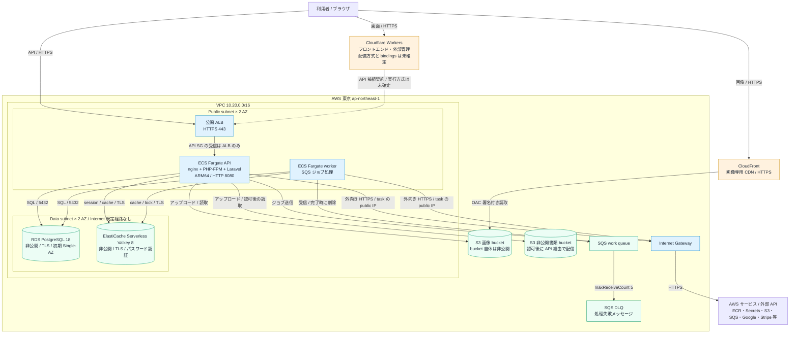
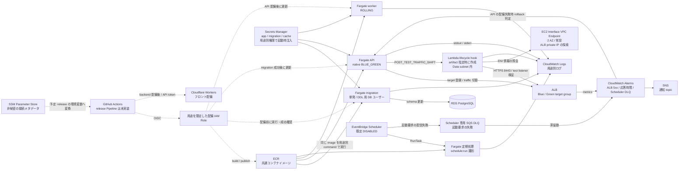
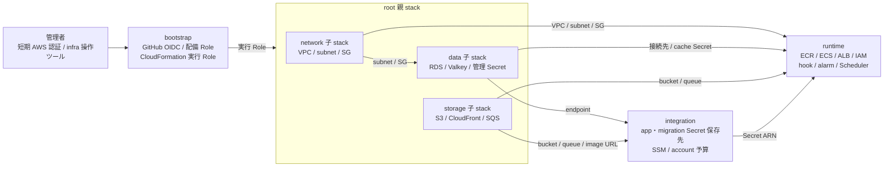
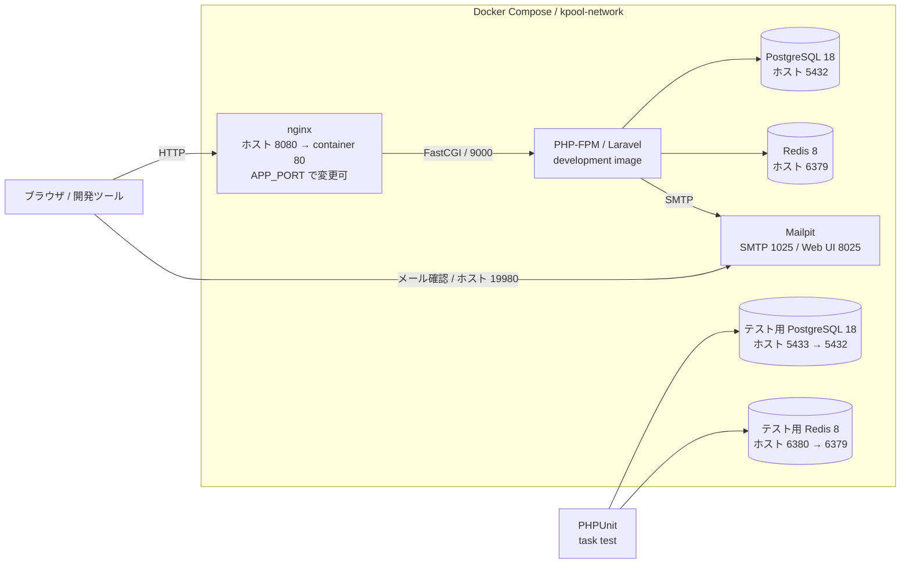

# インフラ構成図

2026-10-05 時点のリポジトリ内の CloudFormation、接続台帳、Docker Compose に基づく図。Fargate は Public subnet＋public IP、受信は用途別 Security Group で制限する構成。AWS / Cloudflare の実環境は照会していないため、配備済み・稼働中であることを示すものではない。台数や接続先の実値は CloudFormation Outputs、ECS、ALB、Scheduler で確認する。

Mermaid 対応の Markdown ビューアで表示・編集できる。矢印は要求・操作の方向を表し、レスポンスの戻り方向は省略する。破線は図ごとのラベルに示す補助経路や予定の接続を表す。

## サービスの全体像

- API / worker の初期 desired count は **0**。図内のサービス経路は稼働用 release task 起動後の構成を表す。
- ALB と API / worker / migration / 定期 task は public subnet に配置し、task の public IP を有効化する。外向き HTTPS は Internet Gateway 経由。NAT Gateway と task 専用 private subnet は定義しない。DB / Valkey と hook 用の data subnet は internet 既定経路を持たない。
- API の受信は ALB SG からの 8080 のみ。worker / migration に受信許可はない。public task は SG の受信制限に依存し、設定を Internet 向けに広げると直接到達し得るため、実 SG と template の一致を確認する。
- S3 / SQS などへの矢印はサービスの操作関係を表し、task からの通信は上記 Internet Gateway 経路を通る。task ごとの public IPv4 料金は発生する。
- 2 AZ の subnet があることと、DB が Multi-AZ で稼働することは別。RDS の `DatabaseMultiAZ` の既定は `false`。
- API / 画像 DNS は接続台帳で初期 **DNS-only** を指定。Cloudflare proxy の有効化は別判断。API 証明書は東京、CloudFront 画像証明書は **us-east-1**。
- Cloudflare Worker の実際の配備方式・bindings は未確定。図の破線は API URL の接続契約を示し、すべてのブラウザ要求が Worker を経由すると断定しない。

### subnet を 2 AZ に分ける理由

| 区分 | 配置と目的 |
|---|---|
| Public × 2 | ALB の通常の AZ 配置は異なる AZ の subnet が最低 2 つ必要。Fargate も両方を起動先に指定する |
| Data × 2 | RDS の DB subnet group は Single-AZ DB でも最低 2 AZ をカバーする。DB / Valkey と private hook を配置する |

合計 4 subnet。2 AZ の起動先を指定しても task が常時 2 台になるわけではなく、DB が Multi-AZ になるわけでもない。台数と冗長化はそれぞれ desired count と DatabaseMultiAZ で設定する。

## 配備と運用の流れ

実線はテンプレートにある接続、破線は接続台帳に記載された未実装の release Pipeline の操作を示す。Blue/Green の新旧 API task が併存するのは配備・bake 中で、通常時の台数は desired count で決まる。ALB と hook 用 VPC Endpoint は常設で、配備の有無にかかわらず料金が発生する。

Scheduler の既定は毎分の汎用雛形だが、アプリが必要とする 2 用途の周期・送信権限・処理失敗監視は未達。運用文書では、これらを解消してから有効化する。Scheduler DLQ はジョブ処理の失敗や task の非 0 終了を捕捉するものではない。SNS の購読先、hook artifact、外部 canary alarm の実設定も実環境で確認が必要。

## CloudFormation の管理単位

矢印は依存情報・Outputs の受け渡しを表す。基盤変更は管理者の操作ツールが扱い、アプリ用 release Pipeline は基盤を変更しない。

## ローカル開発環境

本番とは別に、Docker Compose の `kpool-network` 上で実行する構成。

ローカル/テストと本番テンプレートは PostgreSQL 18 に揃える。本番はメジャー18を指定し、作成時にRDSが対応minorを選択する。minor自動更新も有効にする。ローカルには本番の ALB、SQS、CloudFront、Valkey Serverless に相当する Compose service は定義されていない。

## 参照元

- [インフラの入口](../../infra/cloudformation/README.md)：構成と管理責任
- [network.yaml](../../infra/cloudformation/network.yaml)、[data.yaml](../../infra/cloudformation/data.yaml)、[storage.yaml](../../infra/cloudformation/storage.yaml)：ネットワークとデータ基盤
- [runtime.yaml](../../infra/cloudformation/runtime.yaml)、[integration.yaml](../../infra/cloudformation/integration.yaml)、[bootstrap.yaml](../../infra/cloudformation/bootstrap.yaml)：実行基盤と権限・設定
- [接続台帳](pipeline-handoff.md)：Cloudflare、DNS、Pipeline、未達ゲート
- [コンテナ実行契約](container-runtime.md)、[queue 契約](queue-operations.md)：実行・非同期処理
- [docker-compose.yml](../../docker-compose.yml)：ローカル構成

構成変更時は対応する図も更新する。実環境の確認結果は [検証票](validation-checklist.md) に記録し、テンプレート既定値と実際の設定を混同しない。
